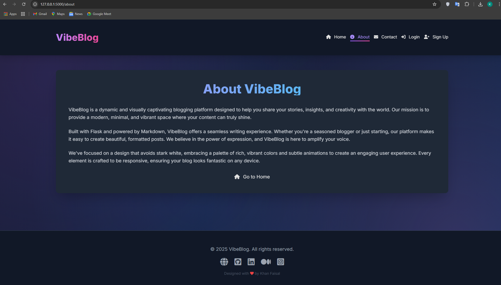
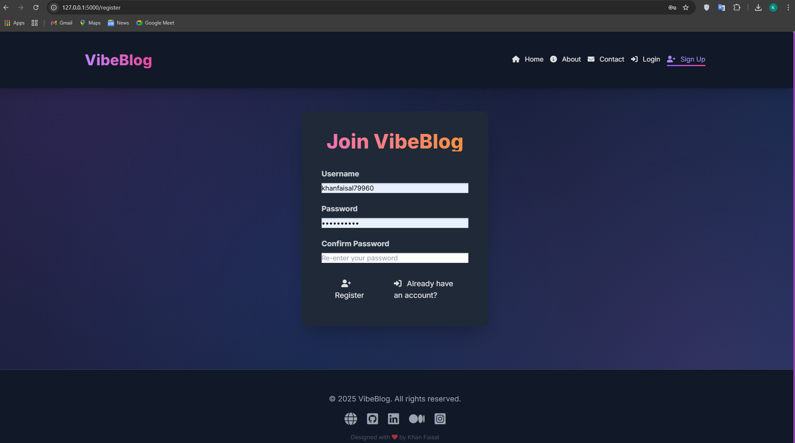

# 🎉 VibeBlog — Share Stories in Style, Powered by Flask


**VibeBlog** is a vibrant, modern blogging platform built with **Flask**, **Markdown**, and **Tailwind CSS**. It delivers a seamless reading and writing experience for both guests and authenticated users through its dark-themed, animated, and mobile-responsive design.

---

## 🌐 Live Demo

👉 [**View Live Demo**](https://vibe-blog-three.vercel.app)

---

## 🔥 Features

- 🔐 **User Authentication**: Secure sign-up and login/logout flow.
- 🌍 **Guest Browsing**: Anyone can browse posts without signing in.
- ✍️ **Post Management**: Create, edit, and delete blog posts with ease.
- 📝 **Markdown Support**: Write beautifully formatted blogs using markdown.
- 🎯 **Tag Filtering & Search**: Easily find posts by keyword or tag.
- 📱 **Fully Responsive**: Tailwind CSS ensures a smooth mobile experience.
- 🎨 **Dark Theme + Animations**: Stylish gradient visuals and fluid interactions.
- ⚡ **Flash Messages**: Get real-time feedback after user actions.
- 🦶 **Custom Footer**: Clean, professional footer with contact links.

---

## 📸 Project Screenshots

| Homepage | About | Register |
|----------|------------|-------------|
|  |  |  |

---

## 🧠 How it Works

- Visitors can explore all posts even without logging in.
- Authenticated users can create and manage their posts.
- All content is stored in local JSON files (for demo purposes).
- Markdown-it renders post content dynamically for a rich UX.
- Flash messages and route protection guide users throughout.

---

## 🛠️ Tech Stack

- **Backend**: Flask (Python)
- **Frontend**: Tailwind CSS, HTML, Jinja2 Templates
- **Auth & Logic**: Werkzeug, Flask Sessions
- **Content**: Markdown-it for rendering posts
- **Storage**: Local JSON files (`users.json`, `posts.json`)

---

## 📁 Project Structure

```
VibeBlog/
├── app.py
├── requirements.txt
├── posts.json
├── users.json
├── vercel.json
├── assets/
│   ├── screenshot_1.png
│   ├── screenshot_2.png
│   └── screenshot_3.png
├── static/
│   ├── css/
│   │   └── style.css
│   └── js/
│       └── script.js
└── templates/
    ├── base.html
    ├── index.html
    ├── login.html
    ├── signup.html
    ├── create_post.html
    ├── edit_post.html
    └── view_post.html
```

---

## 🚀 Getting Started

```bash
git clone https://github.com/khanfaisal79960/VibeBlog.git
cd VibeBlog
python -m venv venv
source venv/bin/activate  # or .\venv\Scripts\activate on Windows
pip install -r requirements.txt
python app.py
```

Then open your browser at: [http://127.0.0.1:5000/](http://127.0.0.1:5000/)

> 💡 For production, consider replacing `users.json` and `posts.json` with a real database.

---

## 💡 Usage Guide

- Browse posts freely without logging in.
- Register to create and manage your posts.
- Use markdown to format blog content.
- Click on tags or use the search bar to find relevant posts.
- Your posts can only be edited or deleted by you.

---

## 🙋‍♂️ Author

**Faisal Khan**

- 🌐 [Portfolio](https://khanfaisal.netlify.app)
- 💼 [LinkedIn](https://www.linkedin.com/in/khanfaisal79960)
- ✍️ [Medium](https://medium.com/@khanfaisal79960)
- 📸 [Instagram](https://instagram.com/mr._perfect_1004)
- 💻 [GitHub](https://github.com/khanfaisal79960)